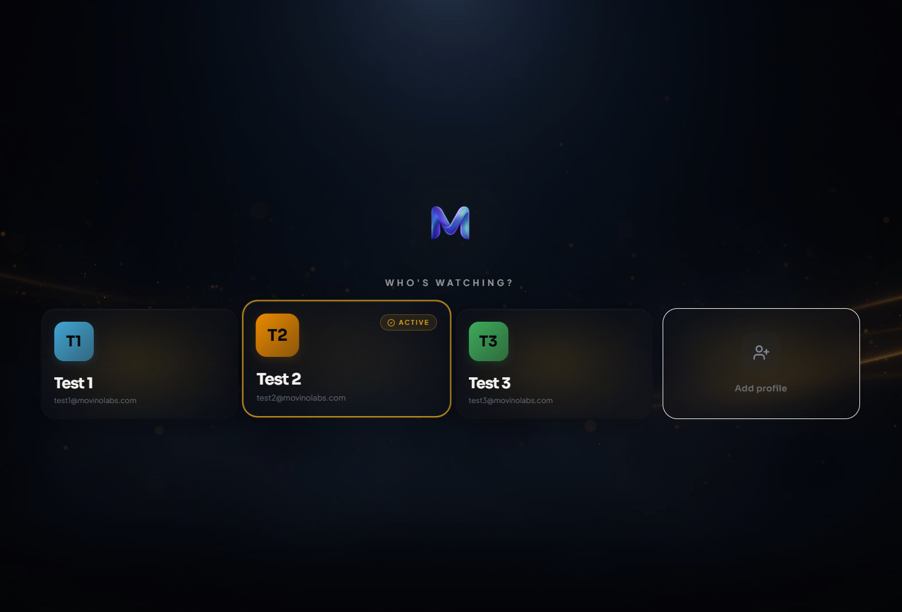
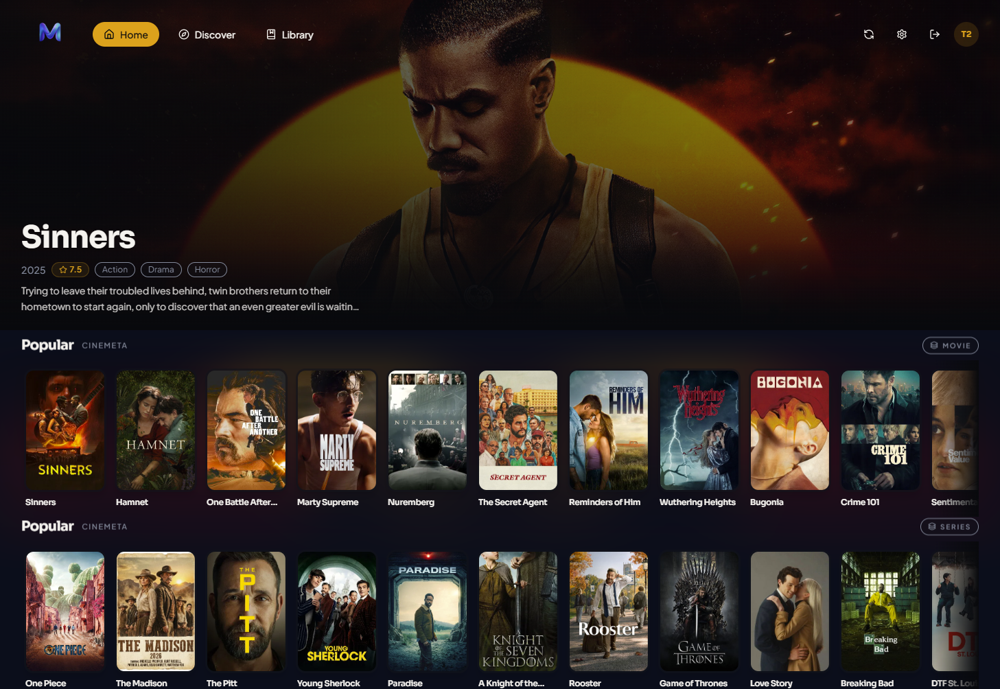
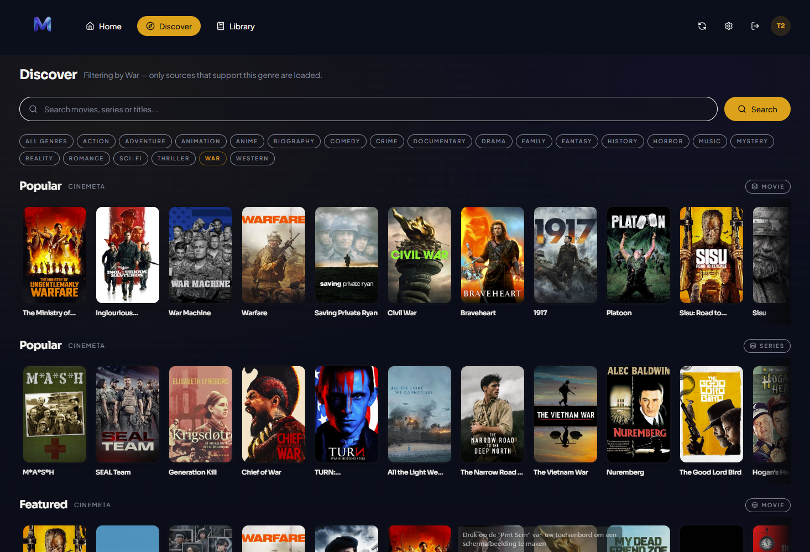
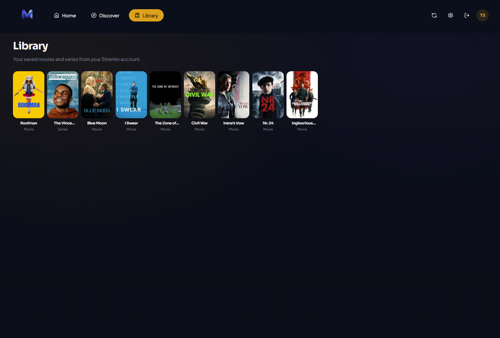
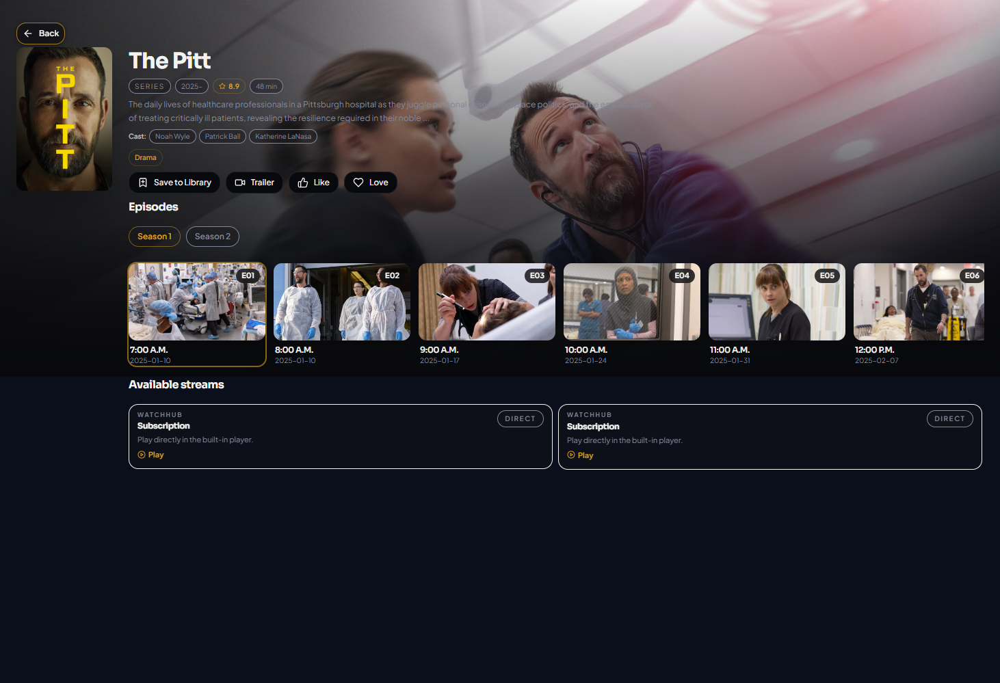
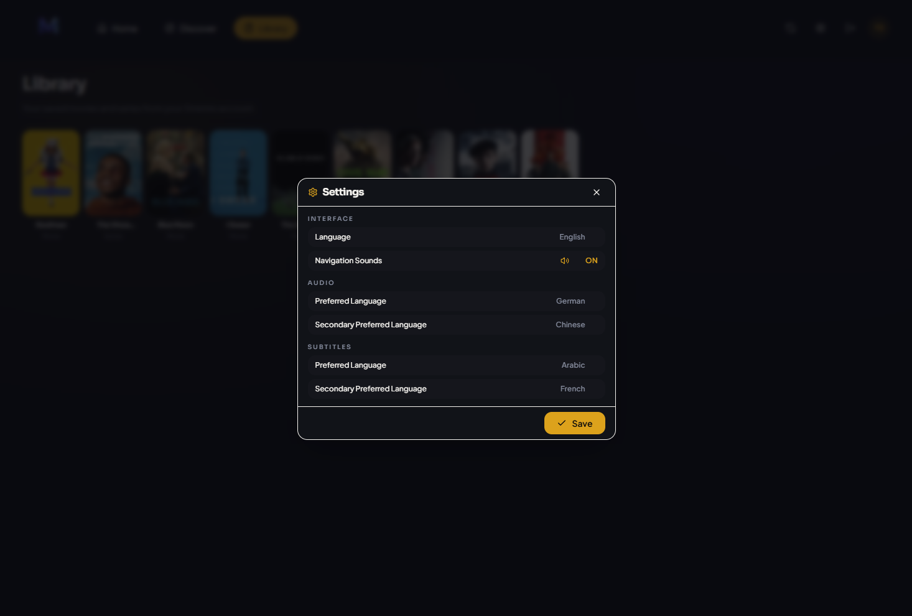

# Movino

Independent Android TV client for Stremio users, designed for a better TV-first experience using your Stremio account, with profiles, improved genre browsing, and remote-friendly navigation.

## Why I built this

I built Movino to solve a few gaps I personally experienced in the Android TV experience, such as missing profiles, missing PIN support, and weaker genre discovery.  
This project is an independent implementation focused on usability, polish, and a better living room experience.

## Movino v1.0 highlights
	•	👤 Profiles
	•	🔐 PIN protected profiles
	•	🧭 Advanced genre browsing
	•	▶️ Continue Watching
	•	🌍 35 languages
	•	🔃 Sync button
	•	✨ Cinematic TV-first UI

## Safety / Security
	•	🔒 Movino does not run its own account backend or relay server
	•	📦 The app stores only the data it needs locally on the device for functionality
	•	🔑 Sign-in uses your Stremio account, and Movino works within the existing Stremio ecosystem
	•	👀 The source code is fully public on GitHub, so anyone can inspect how the app works
  
## Important disclaimer

**Movino is an independent third-party project. It is not affiliated with, endorsed by, or maintained by Stremio.**

Movino uses the public Stremio ecosystem and publicly accessible APIs/resources, but all application code in this repository is independently written and maintained.

## Privacy

Movino does not operate its own backend for account relay or authentication proxying.  
Authentication happens against the Stremio ecosystem, and app data required for functionality is stored locally on the device.

## Status

**Version 1.0**

This is the first public release.

## Donations
Donations are appreciated and help support continued development: https://ko-fi.com/movino

## Screenshots

## Support

This is the first public release (v1.0), so feedback is very welcome.
If the community likes it, I’ll keep improving it and may explore other platforms.
Bug reports, feature ideas, and general feedback are appreciated.

Please note: this first version has not yet been tested on Amazon Fire TV / Fire OS devices. I’d like to explore full compatibility and support for those devices in a near future release.

## Contact
For questions, feedback, bug reports, or other inquiries: movinolabs@outlook.com

